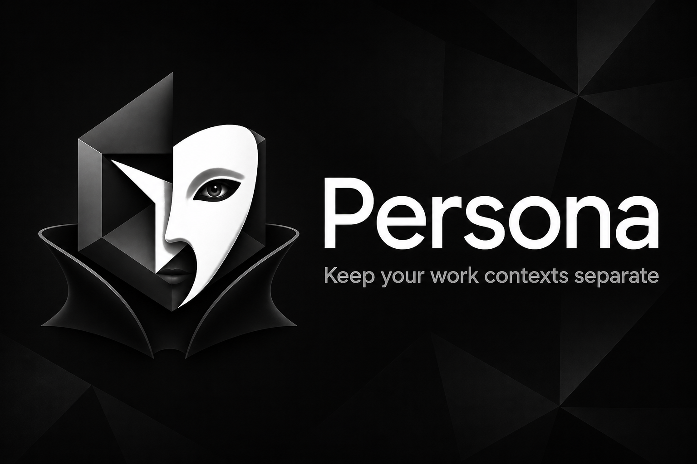

  

  <strong>Attribute Cursor costs to projects, not the seat.</strong>

  <a href="https://open-vsx.org/extension/Beyourselflabs/persona">Install Persona</a>
  ·
  <a href="https://www.beyourselflabs.com/pro">Plans &amp; pricing</a>
  ·
  <a href="https://www.beyourselflabs.com">Documentation</a>
  ·
  <a href="https://github.com/beyourselflabs/persona-pro/issues/new?template=bug_report.yml">Report a bug</a>

Teams need Cursor usage by repository, not just by user, model, and day. Cursor's Team exports still stop at the seat. Without repo-level numbers, AI spend becomes overhead you absorb instead of a billable project cost.

[Persona](https://www.beyourselflabs.com) already routes each repo to the right account. **Persona Pro** turns that mapping into the project ledger those exports never included.

## What Pro adds

|                                    | Free Persona | Persona Pro | Pro + |
| ---------------------------------- | ------------ | ----------- | ----- |
| Account switching & routing        | Yes          | Yes         | Yes   |
| Spend for the current window       | Yes          | Yes         | Yes   |
| Insights dashboard (per project)   | —            | Yes         | Yes   |
| Model breakdown & CSV export       | —            | Yes         | Yes   |
| Agents Window / Cloud Agents sync  | —            | Yes         | Yes   |
| Team-wide ledger                   | —            | —           | Coming soon |

**Free Persona** covers switching, routing, and estimated spend for the project in the current window.

**Pro** unlocks the Insights dashboard with cost and model breakdown per project, CSV export for invoices and job codes, and optional Agents Window token sync. Includes a free 30-day trial on this machine; a license unlocks every persona window on that machine.

**Pro +** (coming soon) rolls the ledger up across the team: token counts and costs per project for billables and forecasting.

## Who it's for

- **Client & contract work** — Put estimated Cursor cost on the engagement, SOW line, or cost center that should carry it.
- **Product & Engineering** — Roll spend up by repo and persona so capex and run-rate opex stay in separate buckets.
- **Finance & delivery** — Forecast spend by project, reconcile to budgets and job codes, and close the month with repo-level totals instead of one seat number from Cursor.

## Get Pro

1. [Install Persona](https://open-vsx.org/extension/Beyourselflabs/persona) from Open VSX and set up your personas.
2. In Cursor, open **Cursor Insights** (or run **Persona: Start Free Pro Trial**) to try Pro for 30 days on this machine.
3. When you have a license, run **Persona: Enter Pro License** and paste your key (`PERSONA-PRO.…`).

Pricing is coming soon. See [Plans & pricing](https://www.beyourselflabs.com/pro) for the full comparison.

## Bug reports

Use the [bug report form](https://github.com/beyourselflabs/persona-pro/issues/new?template=bug_report.yml). Anyone can file an issue. **Persona Pro** license holders get priority triage.

Include **Persona version**, **Cursor version**, and **steps to reproduce** as a numbered list (1. 2. 3.). Check the Pro license box if you have one.

## Notes

Cost figures are estimates from local Cursor databases and public model rates. Cursor does not publish billed dollars per repository. Pro reads the same local data Persona already uses for routing; nothing leaves your machine unless you opt into Pro + when it ships.

## Links

- [Persona documentation](https://www.beyourselflabs.com)
- [Plans & pricing](https://www.beyourselflabs.com/pro)
- [Report a bug](https://github.com/beyourselflabs/persona-pro/issues/new?template=bug_report.yml)
- [Open VSX](https://open-vsx.org/extension/Beyourselflabs/persona)
